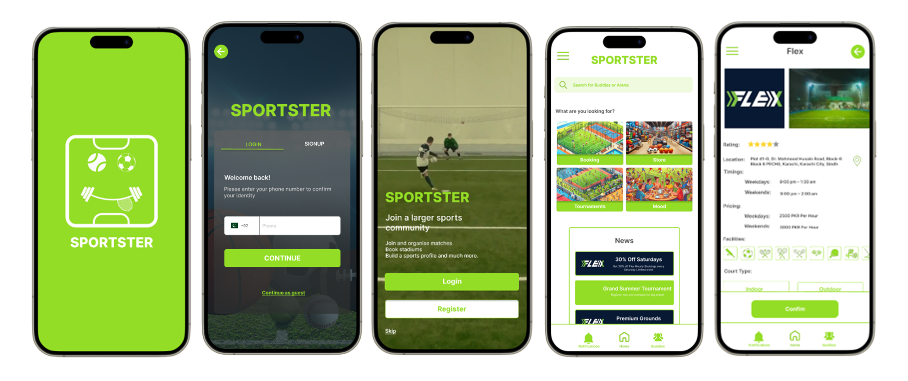

# SPORTSTER

## 🚀 Overview
**SPORTSTER** is an all-in-one platform designed for the sports community. It provides services such as sports facility booking, tournament management, an online store, and social networking for sports enthusiasts.

## 🎯 Features
- 🏆 **Tournaments:** Create, manage, and participate in sports tournaments.
- 📅 **Bookings:** Reserve sports venues and facilities with ease.
- 🛍️ **Store:** Buy and sell sports gear within the community.
- 👥 **Social Connect:** Engage with fellow athletes and sports enthusiasts.
- 📊 **Analytics:** Get insights and performance stats.
- 📱 **Mobile App:** Available as an APK for Android devices.

## 📂 Repository Contents
- **SPORTSTER Report.pdf** – Detailed project documentation.
- **SPORTSTER Presentation.pptx** – Project presentation slides.
- **SPORTSTER Poster.pdf** – Project poster.
- **SPORTSTER Figma Design** – UI/UX design prototype.
- **SPORTSTER Figma Design Video.mp4** – Walkthrough of the Figma design.
- **SPORTSTER APK File** – Android application for testing.
- **SPORTSTER Application Demo Video.mp4** – A demo showcasing app features.

## 📸 SPORTSTER application
Here are some visuals of the SPORTSTER application:


## 🔗 Live Prototype
Check out the Figma prototype:  
[](https://embed.figma.com/proto/j5iAYK4qatJbQMLlTpkgiQ/Report---Sportster-Prototype-User-App?node-id=51-3&p=f&scaling=scale-down&content-scaling=fixed&page-id=0%3A1&starting-point-node-id=3215%3A1770&embed-host=share)

## 🔐 License
This project is licensed under the **Custom License**. Unauthorized copying, modification, or commercial use of this codebase is prohibited.

```
Copyright (c) 2025

All rights reserved.

Permission is hereby granted, free of charge, to view and use this repository for learning and non-commercial purposes. 
However, no part of this repository may be copied, modified, or used for commercial purposes without the express written permission of the author.

Authors:
- Muhammad Fahad Imdad
- Bilal Ahmed
- Shaheer Wasti
- Huzaifa Mustafa

For inquiries, contact: fahadimdad966@gmail.com
```

## 🤝 Contribution Guidelines
Currently, contributions are **restricted**. If you'd like to suggest improvements, please **open an issue** or contact the repository owner.

## 📧 Contact
For queries, reach out via email: **fahadimdad966@gmail.com**

---
Developed with ❤️ by **Muhammad Fahad Imdad, Bilal Ahmed, Shaheer Wasti, and Huzaifa Mustafa**
